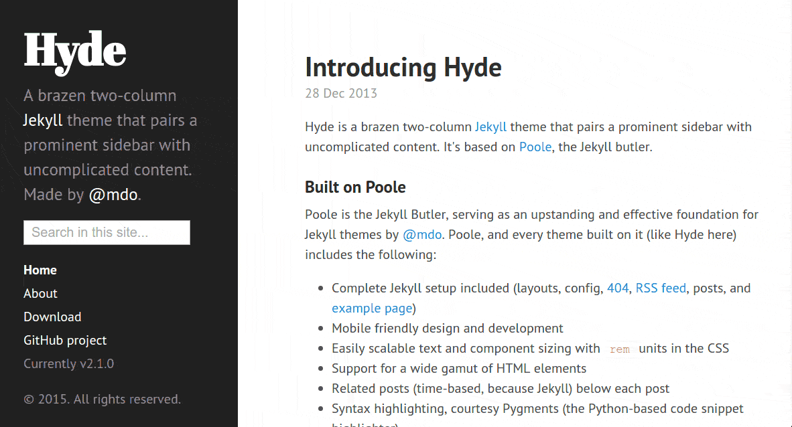

# Hyde

This repository holds our forked version of the popular Hyde theme for Jekyll
([original readme](./README-original.md)).

We've added a search box in the sidebar that provides instant search on all your
posts and pages (provided that you've indexed them with our [Jekyll plugin][1]).

## Maintenance

We'll strive to keep this repository up to date with any update done to the
original Hyde theme.

[1]: https://github.com/algolia/algoliasearch-jekyll
